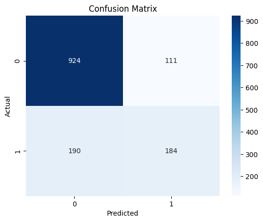
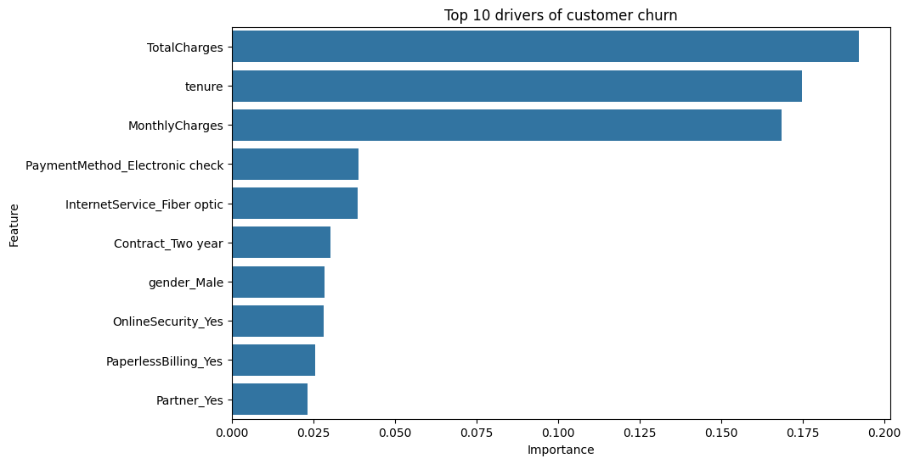
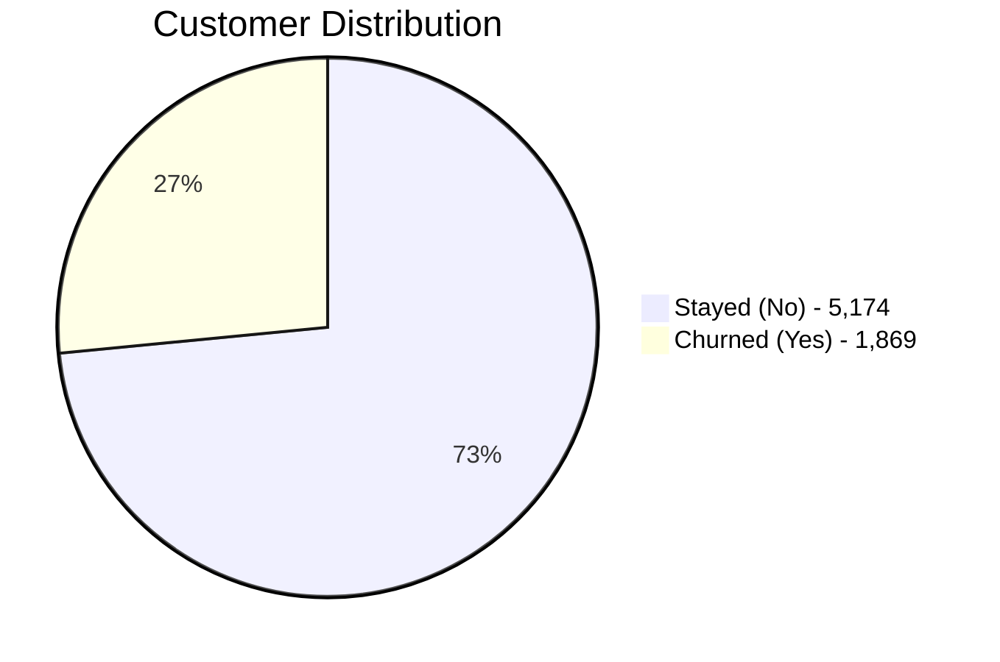
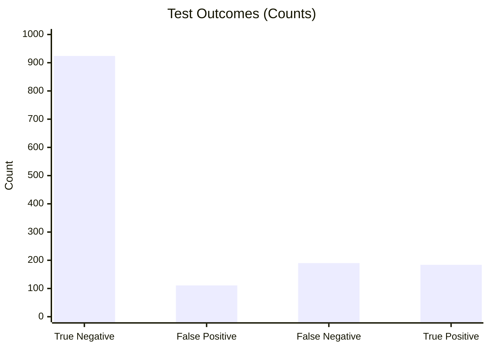
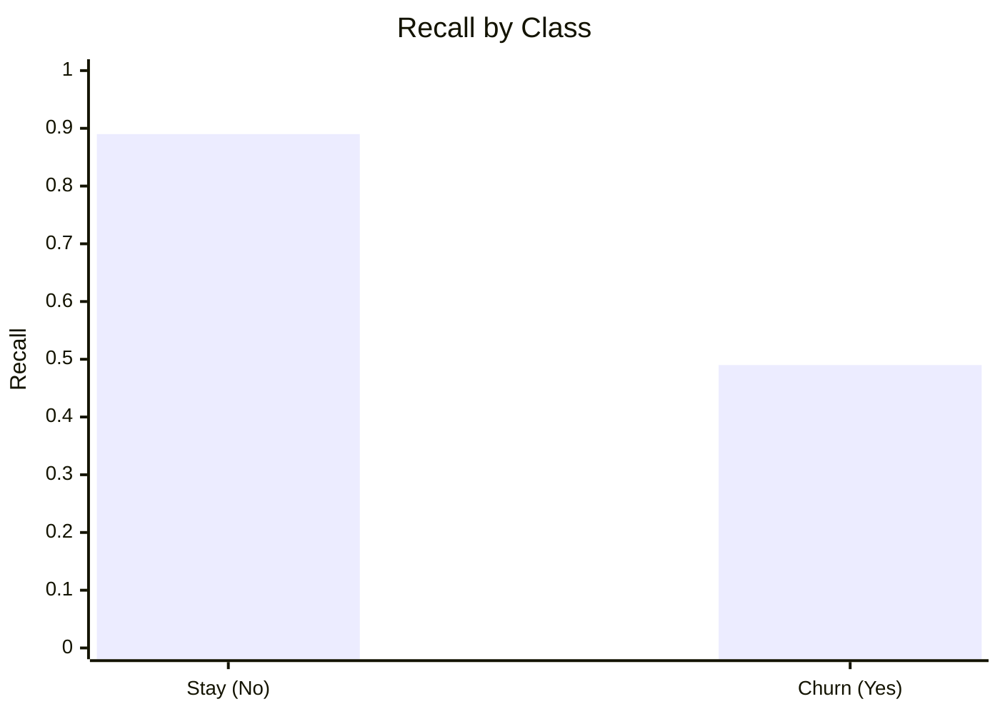
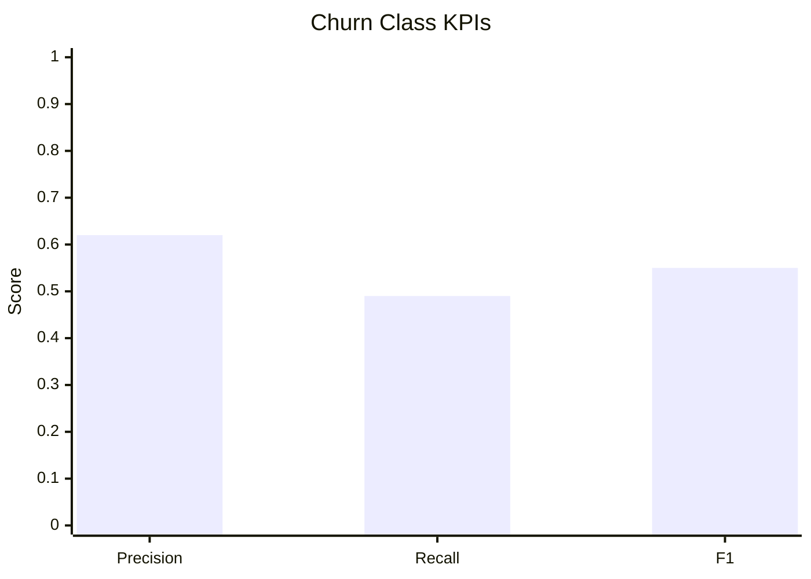
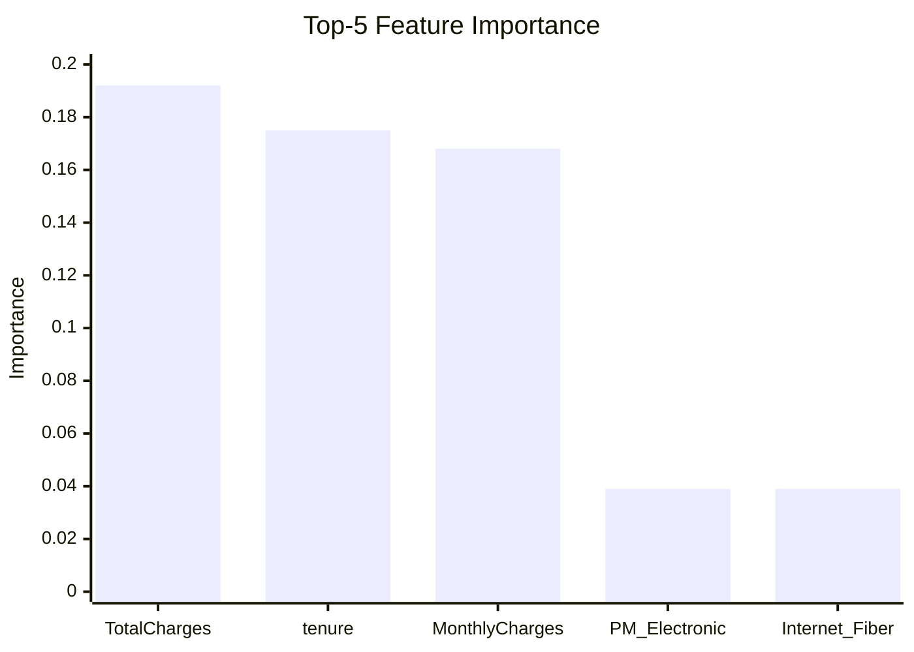

# Board Report: Customer Churn AI – Status and Decisions

Date: 2026-03-15
Audience: Board and Leadership

## Executive Summary
A churn prediction model is operational after fixing data formatting. Baseline accuracy is **78.64%**, but churn detection recall is **49%**, which is below business requirement for retention impact. Recommendation: **approve a time-boxed optimization + pilot** before full rollout.

## Board Decisions Required
1. **Approve** a 4–6 week model optimization sprint.
2. **Approve** a controlled retention pilot (limited segment).
3. **Set go/no-go gates** tied to recall and ROI.
4. **Defer full rollout** until KPI gates are met.

## Business KPI Snapshot (Current)

| Metric | Current | Business Read |
|---|---:|---|
| Accuracy | 78.64% | Acceptable as baseline |
| Churn Recall (Yes class) | 49% | Too low for production |
| Churn Precision (Yes class) | 62% | Moderate |
| False Negatives (missed churners) | 190 | High risk to retention ROI |

## Full Model KPI Dashboard

### Core model KPIs

| KPI | Value |
|---|---:|
| Accuracy | 78.64% |
| Precision (Churn = Yes) | 62.0% |
| Recall (Churn = Yes) | 49.0% |
| F1 (Churn = Yes) | 55.0% |
| Precision (Stay = No) | 83.0% |
| Recall (Stay = No) | 89.0% |
| F1 (Stay = No) | 86.0% |
| Macro F1 | 71.0% |
| Weighted F1 | 78.0% |

### Confusion matrix KPIs

| Metric | Value |
|---|---:|
| True Negative (TN) | 924 |
| False Positive (FP) | 111 |
| False Negative (FN) | 190 |
| True Positive (TP) | 184 |
| Specificity (No class recall) | 89.3% |
| False Positive Rate | 10.7% |
| Churn Miss Rate | 50.8% |

### Top model drivers (importance)

| Rank | Feature | Importance |
|---:|---|---:|
| 1 | TotalCharges | 0.192 |
| 2 | tenure | 0.175 |
| 3 | MonthlyCharges | 0.168 |
| 4 | PaymentMethod_Electronic check | 0.039 |
| 5 | InternetService_Fiber optic | 0.039 |

## Charts

### 1) Customer Base Mix (Class Imbalance)

### 2) Model Outcomes on Test Set

### 3) Recall Gap (Business Risk)

### 4) Churn-Class KPI Breakdown

### 5) Top-5 Feature Importance

Business interpretation:
- Strong on identifying customers who stay.
- Weak on catching churners early enough (missed churners remain high).

## What was wrong
The first model run failed because text values were sent to an algorithm that accepts only numeric inputs.

## What was fixed
The team corrected preprocessing by:
- removing identifier fields,
- converting text-based numeric values,
- encoding categorical fields,
- and retraining successfully.

## Current performance in business terms
- Good at identifying customers who stay.
- Moderate at identifying customers likely to leave.
- Main risk: missed churners reduce retention campaign effectiveness.

## Decision Options for Board

| Option | Timeline | Risk | Expected Impact | Recommendation |
|---|---|---|---|---|
| A: Roll out now | Immediate | High | Uncertain, likely underperformance | No |
| B: Optimize + pilot | 4–6 weeks | Medium | Higher confidence, measurable ROI | **Yes** |
| C: Pause project | Open-ended | Medium/High (opportunity cost) | No near-term value | No |

## Proposed plan
1. Improve model to raise churn recall.
2. Tune decision threshold based on retention economics (cost to contact vs value saved).
3. Validate with cross-validation and holdout tests.
4. Deploy in controlled pilot (limited customer segment).
5. Scale only if KPI targets are met.

## KPI gates for scale-up
- Churn recall >= 70%
- Positive retention ROI in pilot
- Stable model performance over 2 consecutive evaluation periods

## Financial Framing (for decision)
- **Cost side:** campaign contacts + discounts/offers.
- **Benefit side:** churn prevented × retained customer value.
- **Rule:** scale only if pilot shows positive net value at approved threshold.

## Governance and risk controls
- Monthly model monitoring and retraining policy
- Drift and quality alerts
- Clear ownership: Data team (model), CRM team (campaign operations), Finance (ROI tracking)

## What to avoid going forward
- Training without strict preprocessing checks
- Using default probability threshold without business-cost analysis
- Deploying without pilot validation and monitoring controls

## Ask
Approve Option B (**optimize + pilot**) with go/no-go review at sprint completion.
